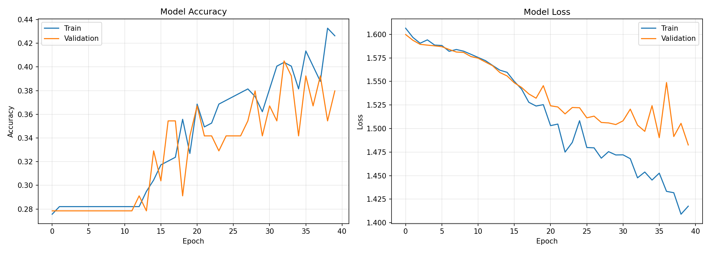
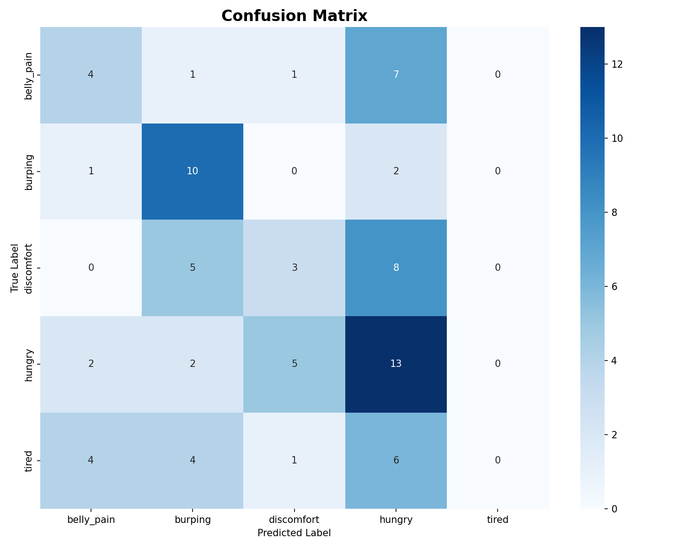
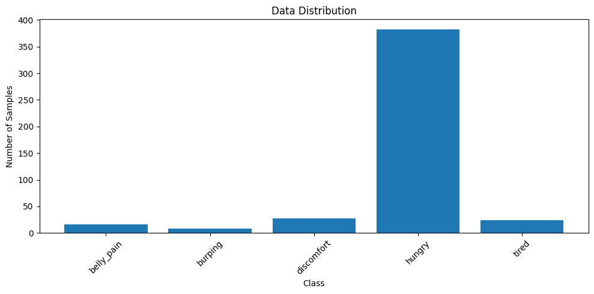
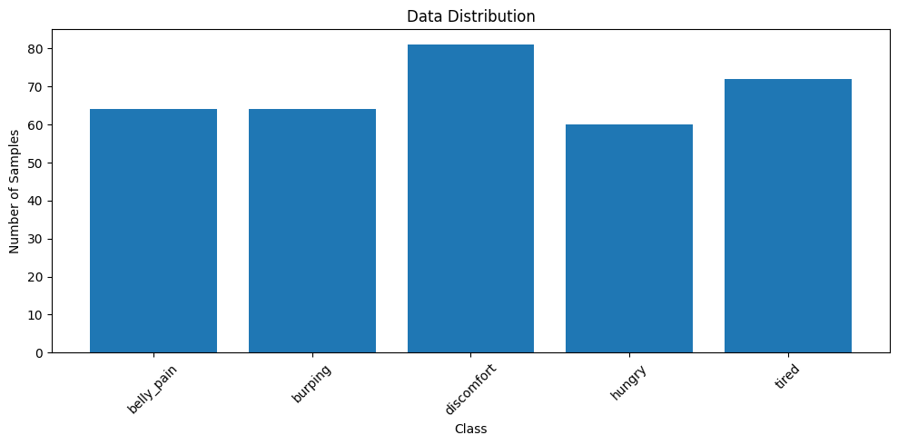

# cry_analyzer

## Model 
https://drive.google.com/file/d/1szE_3IFeeR5-WK1p4GEbuyg1xlWRdH4O/view?usp=sharing

**Results**

Validation Accuracy: 38.0%

Model predicts 4 different classes:
- belly_pain     :  11 predictions ( 13.9%)
- burping        :  22 predictions ( 27.8%)
-  discomfort     :  10 predictions ( 12.7%)
- hungry         :  36 predictions ( 45.6%)

Per-class Accuracy:
- belly_pain     :  30.8% (4/13)
-  burping        :  76.9% (10/13)
-  discomfort     :  18.8% (3/16)
-  hungry         :  59.1% (13/22)
-  tired          :   0.0% (0/15)





## Dataset
I borrowed from: 
- [Infant cry audio corpus](https://github.com/gveres/donateacry-corpus)



Since the dataset is too imbalanced, I ueed some augmentation techniques to balance the dataset. 
- --target for the number of target data after balancing 

```bash
python balance_data.py cry_data --target 60 --strategy hybrid
```

After balanced: 



# RasberryPi

[Here](https://github.com/eigenValue7/Interactive-Lab-Hub/tree/Fall2025/Lab%205/cry_analyzer)

